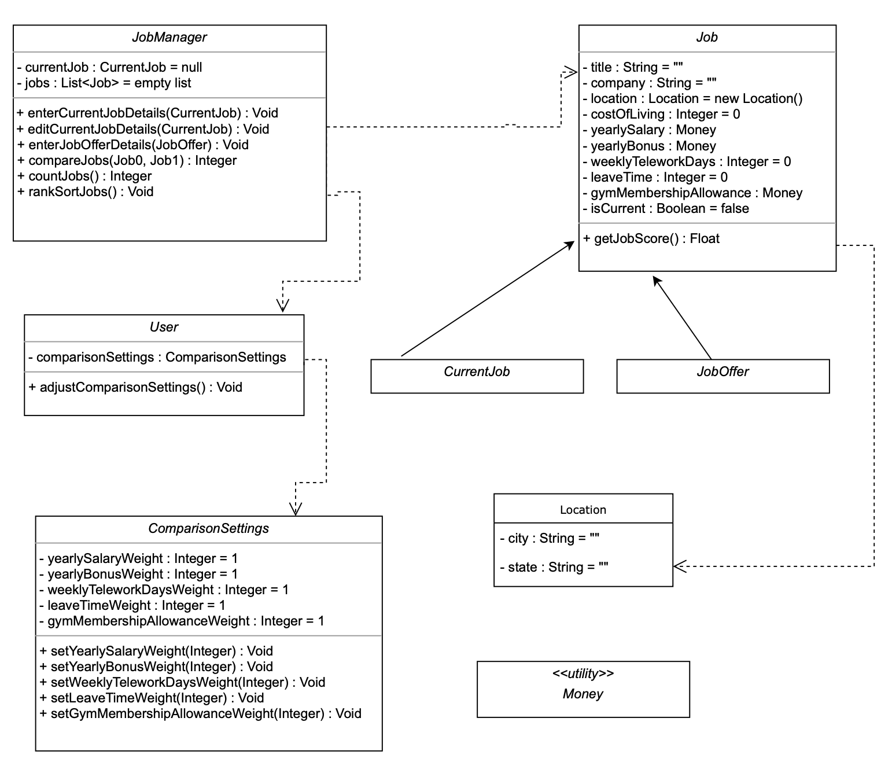
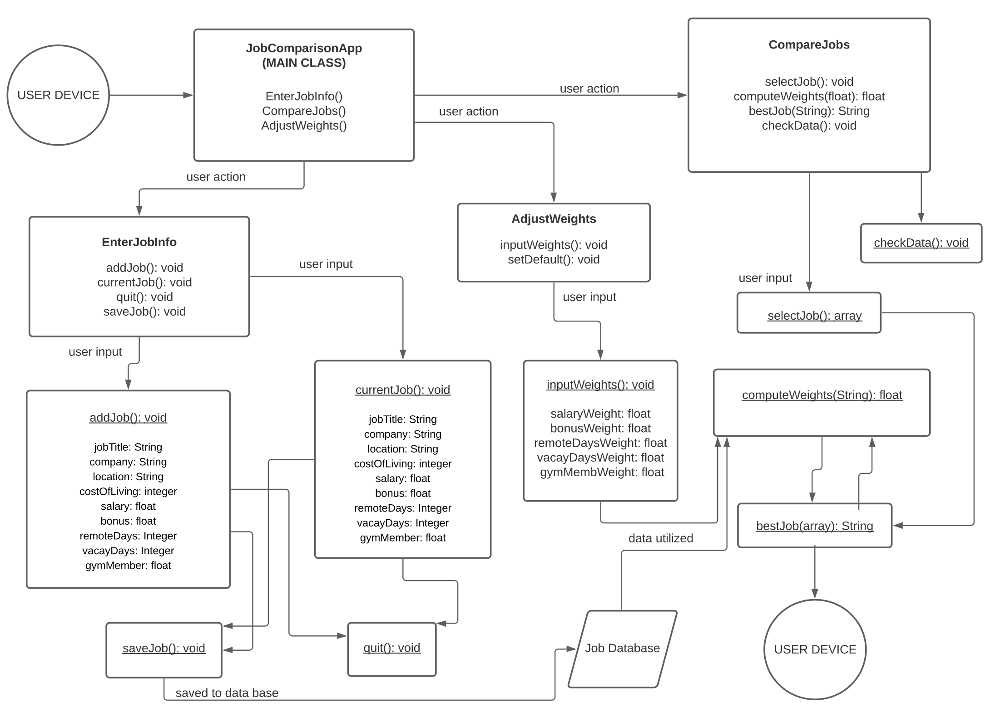
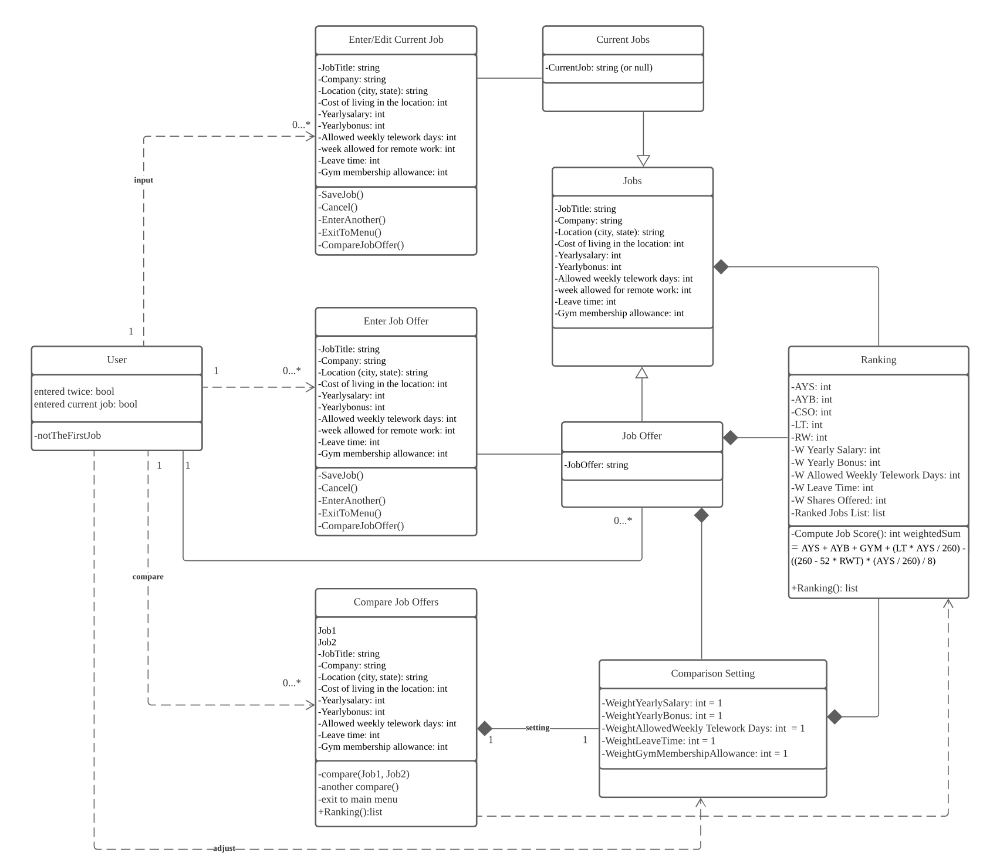
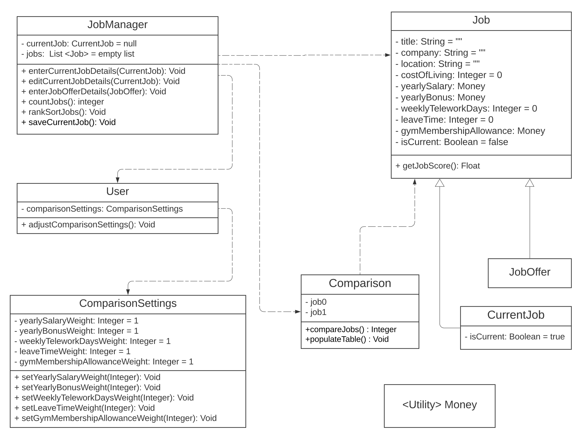

# Team discussion

## Individual Designs
### Design 1 - David Strube

* Pros: 
	* Accounts for most of the objects and functions as described in the original Assignment 5 background
* Cons: 
	* Some gaps and uncertainties as to whether all parts are accounted for
	* Location class may be unnecessary
	
### Design 2 - Jessie Wang

* Pros: 
	* Detailed coverage of most parts of Assignment 5
* Cons: 
	* User Device shows up twice
	* Unnecessary database component
	
### Design 3 - Mingming Wang

* Pros: 
	* Detailed coverage of most parts of Assignment 5, especially Ranking
* Cons: 
	* Some of the classes (e.g. EnterJobOffer & CompareJobOffer) aren't nouns but rather verb phrases
	* CurrentJob numerical relationship to User is inaccurate- should be 0..1, not 0..*

## Team Design

* Commonalities 
	* Like all the other designs, this one seeks to model the classes, attributes, and operations implied with Assignment 5
	* All the designs have classes for Users, Jobs, and Comparisons / Rankings
* Differences
	* Unlike Design 2 & 3, this design has all the classes named after nouns
	* Unlike Design 1, this design has a class for Comparisons, and no class for Location
* Justifications
	* A Comparison class made sense in the context of needing to be able to compare a current job with the job offer that was just added
	* In our discussions, we decided that the Location class was redundant

## Summary 

### 1. We have email contact and discussed the project almost every day. 
### 2. We had two meetings in the last week. And during the meeting, we introduced ourselves, including our backgrounds, interest in the CS6300 course, and our future plan on this project.
#### 2.1 In the first meeting, we shared and reviewed the design.pdf with each other, we discussed some questions and improvements on how to get a better design. We thought David’s design is clearer and better, then we decide to moving on with his design as the template and then make some detailed revision.
#### 2.2 after the meeting, Jessie made the new design UML file. We discussed a lot of the detail about the attibutes, classes, and optimization of the UML by email. Jessie and Mingming provide some idea and suggestions for the UML. David provide lots of professional explaintion to questions from Jessie and Mingming. 
#### 2.3 In the second meeting, and we further discussed the modified UML in detail. We added a new class of Comparison. Some attributes and methods were also added in the UML. The layout of the UML was optimized either. 

## Email discussion record (selected):

#### (from Jessie, 2021-09-29, 4:59PM EST)
Hi Team, 
 
I was just thinking that since we are using David’s skeleton code, we can proceed with his design? From our discussion last time I think we mentioned that location can be stored as a string rather than a class. Also, I think the layout can be refined a bit, I like MingMing's format. I can also put together a draft before tomorrow's meeting. 
 
I rewrote the Requirements section so it looks more like an official project rather than answering the prompt questions. Let me know what you think or if I missed something (see attachment).  
 
Also some questions for discussion tomorrow: 
What is the purpose of the Money class?  
Since there is an editCurrentJobDetails functionality, should there also be one for job offers? (I notice the requirement is not explicit in Assignment 5) 
 
Jessie

##### (from David, 2021-09-29, 5:45PM EST)
Yes, using a string instead of the Location class sounds good, as does using Mingming's format for the layout.

The requirements section looks great.

The purpose of the Money class is just a utility, like the one at the end of lesson P3L2. My thinking was that, in P3L2, it made sense to have a Money class to help with the account of fees due, and it makes less sense in a project where money amounts are just being compared, in which case all money values should be floats; but having a Money class would be easier than formatting the floats to be two digits everywhere they need to be printed. I don't feel strongly about it and could go either way really. I just think it looks nice to have a Money utility class like the one in one of our lessons. 

Good question about the possibility of an editJobOffers function. I was wondering that too, and I believe I saw a post on Ed asking about this where the answer was: Job Offers don't get edited, only entered. However, I can't find that post now. If you want, you can post this question to Ed, but I'm pretty sure that was the answer. (Maybe it was in an office hours session.)

-David

#### (from David, 2021-09-29, 9:10PM EST)
Confirmed in tonight's office hours: no need for an editJobOffers function.

#### (from Jessie, 2021-09-30, 5:12AM EST)
OK I'll review that module, probably should have paid more attention there earlier. 

Here is the updated UML, I didn't really change anything. Location is now a string, and I just formatted the arrows for CurrentJob and JobOffer to look nicer. It's not meant to be a final draft, but since I have it in LucidChart, it'll be easy to modify when we meet, and hopefully can have the final draft done today.

#### (from Mingming, 2021-09-30, 8:51AM EST)
Hi all,
  Thank you very much all for the updating. I agree to proceed with David’s design. Sorry I was on a trip and just got back yesterday night. I will check in detail about the informations. 
  I think for the new UML, we may need to add the function of “exit to the main menu”. What do you think?
  Thank you again.
Best,
Mingming

#### (from Jessie, 2021-09-30, 9:07AM EST)
Hi Mingming, no worries, can you make the meeting tonight? We can discuss our concerns there. I think David mentioned in his .md file that the functionality can be added using the GUI. I'm not entirely sure since I'm not familiar with Android studio.

#### (from David, 2021-09-30, 9:42AM EST)
The new UML is looking good, but a couple edits I'd recommend:
The arrowheads for both JobOffer and CurrentJob should be pointing to Job, not the other way around. (I know, it's kind of counter-intuitive, but the "is-a" Generalization dependency is that JobOffer is a Job, but a Job is not necessarily a JobOffer; same for CurrentJob.) Also, if possible, please make these arrowheads hollow. 
The other arrows (from JobManager to Job, from JobManager to User, and from User to ComparisonSettings) should be dashed, as they are a Dependency relationships. See attached screenshot from lesson P2L2.
Hope this helps.
Looking forward to our meeting later today.

Thanks!
David

#### (from Mingming, 2021-09-30, 10:07AM EST)
Hi all,
    I agree. And I think the current UML looks good either. 
    When drawing the arrow, I think we should leave enough space between the classes for drawing the arrows. 
    I have a question about the job comparison. How to express in the design that the user can save, or cancel the edit without saving in the application?
    Thank you very much.
Best,
Mingming

#### (from David, 2021-09-30, 10:17AM EST)
I'm imagining that the Save button in the UI would call the function for whatever action is being taken.

For example, when entering the information for a job offer, clicking Save would just call the enterJobOffer function. The Cancel button would just return the view back to the previous screen. This is all UI logic and so doesn't need to be in the UML.

However, you do raise an important point about how the UI knows whether it's entering info for the current job or editing it. So maybe we should add a new function in the JobManager class called saveCurrentJob which would check to see if the currentJob exists, and if so call editCurrentJob, else call enterCurrentJob.

-David

#### (from Mingming, 2021-09-30, 10:18AM EST)
Yes. I agree with that.
Thank you very much for your reply, David.
Best,
Mingming

#### (from Mingming, 2021-09-30, 10:22AM EST)
And learned more by your reply.
 Again,  I also confused about the requirement 3c, it showed "When choosing to enter job offers, users will be able to (1) enter another offer, (2) return to the main menu, or (3) compare the offer (if they saved it) with the current job details (if present).
  Do we need to add that and how? I mean there should be some connection between entering the job and comparing the job. Sorry this maybe a silly question (first time to design this).
  By the way, do we need to add a class called “table”? Which contain the items listed in requirement 5c?
  Thank you very much.
Best,
Mingming

#### (from David, 2021-09-30, 12:38PM EST)
Not a silly question. Good to clarify.
For part 1 & 2 (enter another offer & return to main menu)- those are both UI concerns.

For part 3 (compare the offer with the current job) - this should be handled by the compareJobs function. Alternatively, we could add a couple more functions:
   +compareToCurrentJob(JobOffer)
   +setCurrentJob(CurrentJob) - which would have the side effect of enabling the button that is linked to the compareToCurrentJob function

For the table in 5c, that's not a bad idea. I'd recommend we call the new class Comparison. It could have just two fields:    
   -Job0
   -Job1 (in case we want to compare two job offers OR a job offer and the current job), 
and two functions:
   +compareJobs(Job0, Job1) : Integer (moved from JobManager)
   +populateTable() : Void
The relationships would be:
   JobManager depends on Comparison
   Comparison depends on Job

Good questions!

-David

#### (from David, 2021-09-30, 12:41PM EST)
On second thought, if Comparison already has Job0 and Job1 as properties, then they wouldn't need to be parameters of the compareJobs function. So that function's signature would be just:
   +compareJobs() : Integer

-David

####(from Mingming, 2021-09-30, 1:20PM EST)
Got it. Thank you very much for your reply. 
Mingming

####(from Jessie, 2021-09-30, 6:44PM EST)
Here's the udpated design.pdf file, let me know if there needs to be any changes.

#### (from David, 2021-09-30, 7:42PM EST)
Hey Jessie,
Looks great. Just a couple minor tweaks - sorry I didn't notice this sooner.
I think the line from JobManager to Comparison should have the arrow pointing at Comparison (JobManager depends on Comparison), and the line from Job to Comparison should have the arrow pointing at Job (Comparison depends on Job)

Other than that, it's perfect.

Thanks!
-David

#### (from Jessie, 2021-10-01, 9:27AM EST)
Hi all, 

Here's the updated design.pdf. Let me know if there should be any other updates.

Mingming, in case you didn't see earlier, I put together a summary for the requirements section of the design_documentation.md. Attaching it if it's helpful, some parts might need to be updated and refined. 

I think it's still good to have the Classes, Attributes, Operations and Relationships listed like in David's original description: 

https://github.gatech.edu/gt-omscs-se-2021fall/6300Fall21Team020/blob/master/GroupProject/Design-Individual/dstrube3/design-description.md 

Have a nice weekend! 

Jessie

#### (from Mingming, 2021-10-01, 10:18AM EST)
Hi Jessie,
  Thank you very much.
  I will make a summarize and send it to all of you tonight or tomorrow morning.
  Thank you very much. 
Best,
Mingming
