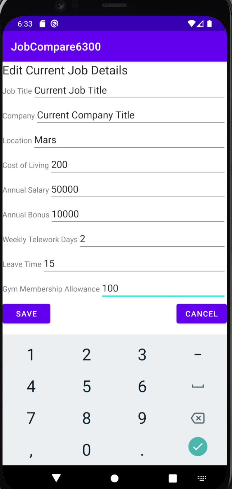

# Design Document

**Author**: Team 020

## 1 Design Considerations

### 1.1 Assumptions

* This application will only be for one user per installation / device. That is, each installation of this application is not expected to keep track of multiple users.
* There is no login process for this application
* The application does not need to track any user information, like demographics or contact information.
* Usr interface design principles need not be adhered to strictly. As long as the device is usable, the UI is good enough.
* No licensing, trademarking, or EULA concerns will be relevant for this project.
* For each class, each public method will be unit tested.
* This application will run on a phone or tablet device.

### 1.2 Constraints

* The user will have, at most, one current job.
* The user will have, at most, 100 job offers.
* Current job and job offers will be stored in a local instance of SQLite
* No connection is needed to an external database or data source.

### 1.3 System Environment

This application must operate in an Android environment. The target SDK version is 29.

## 2 Architectural Design

### 2.1 Component Diagram

There is only one component in this application: the application itself. No network connectivity is required once the application is installed. The database of the application is internal and local to the application. Therefore, the Component Diagram is unnecessary. 

### 2.2 Deployment Diagram

There is only one component to be deployed on actual hardware devices: the application itself. This is a simple system with no multitude of computational units. Therefore, the Deployment Diagram is unnecessary. 

## 3 Low-Level Design

### 3.1 Class Diagram

### 3.2 Other Diagrams

#### 3.2.1 State Diagram

## 4 User Interface Design

