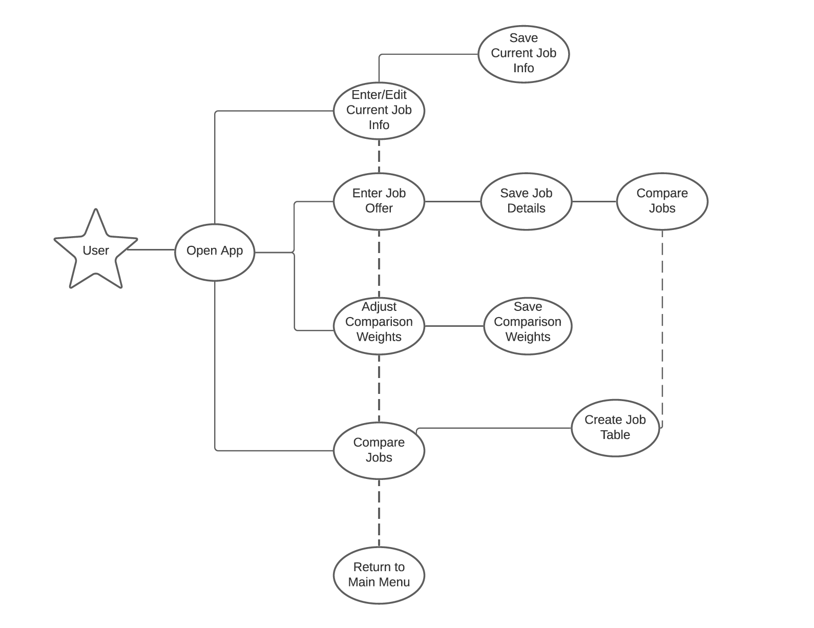

# Use Case Model

**Author**: Team 020

## 1 Use Case Diagram

## 2 Use Case Descriptions

**Use Case:** Open App 
**Requirements:** App is installed on user's device.   
**Pre-conditions:** The user opens the app from their device.  
**Post-conditions:** The user is able to navigate the app from the main menu.  
**Scenarios:** The user is able to open the app from their device, and is able to view the options on the main interface. 

**Use Case:** Enter/Edit Current Job Info 
**Requirements:** User is able to open the app, and the button connecting to entering current job info is functioning as expected.  
**Pre-conditions:** The user is able to open this option from the main menu. 
**Post-conditions:** The user is able to input their current employment information.  
**Scenarios:** The user decides to enter their current job information from the main page of the application, and is successfully able to put in their data as specified in the form.  

**Use Case:** Save Current Job Info 
**Requirements:** User is able to input their current job information into the app (specified by use case Enter/Edit Current Job Info) 
**Pre-conditions:** The user is able to enter their job information as previous use case specifies. 
**Post-conditions:** The user is able to save their job information into the app. 
**Scenarios:** The user decides to save their job info, and their info is saved, likewise they may decide to not save the information, in which the information they inputted will not be saved. 

**Use Case:** Enter Job Info 
**Requirements:** User is able to open the app. Here the user will be entering various job offer information. 
**Pre-conditions:** The user is able to open the option to enter job offer information from the main page of the app. 
**Post-conditions:** The user is able to successfully input job offer information into the interface. 
**Scenarios:** The user is able to select the option to enter job offer information from the main menu, and is able to type their inputs into the form provided in the app. 

**Use Case:** Save Job Details  
**Requirements:** The user is able to save the data they inputted. User is able to open the form and input their job offer. 
**Pre-conditions:** The user is able to input job offer details as expected.  
**Post-conditions:** The user is able to save their job offer. 
**Scenarios:** The user wants to save the job offer information, and is able to, or if they decide not to, they are able to quit without saving the information.  

**Use Case:** Adjust Comparison Weights 
**Requirements:** User will be able to adjust the comparison weights displayed.   
**Pre-conditions:** User sees the default comparison weights, which should be 1 for each category by default.  
**Post-conditions:** The user is able to adjust these weights to any integer appropriate.  
**Scenarios:** The user is able to adjust the importance of a category by increasing the weight from 1 to a number they find appropriate. The user will not make any changes if the default input weights look appropriate to them.  

**Use Case:** Save Comparison Weights 
**Requirements:** User is able to save the weights they inputted. User is able to view and manipulate the adjust comparison weights page of the app. 
**Pre-conditions:** The user is able to enter any desired weight changes. 
**Post-conditions:** The new weights are saved.  
**Scenarios:** The user decides to adjust the user weights, and is able to save them, otherwise, the default specified will be used.  

**Use Case:** Compare Jobs 
**Requirements:** User can specify the jobs that they want to create a comparison for.  
**Pre-conditions:** The user is able to open the compare jobs option. 
**Post-conditions:** The user is able to specify the two jobs that they would like to compare. 
**Scenarios:** The user is able to click Compare jobs, and then select two jobs that they want to compare. 

**Use Case:** Create Job Table 
**Requirements:** User must have selected two jobs to compare as specified in the compare jobs use case, this will then create a table for the comparison. 
**Pre-conditions:** The user has successfully selected the jobs they want to compare. 
**Post-conditions:** A job comparison table is displayed in the app.  
**Scenarios:** The user selects the jobs as specified in previous use case, and is able to view an output comparing the two jobs. 

**Use Case:** Return to Main Menu 
**Requirements:** User is able to return to the main menu after taking any of the four options from the main menu.  
**Pre-conditions:** The user has already used the app, and has tried one of the four options. 
**Post-conditions:** The user returns to the main menu. 
**Scenarios:** The user has chosen one of the four options: edit/enter current job info, enter job offer info, adjust comparison weights, compare jobs, and is on one of their respective interfaces, and wants to return to the main menu. 
