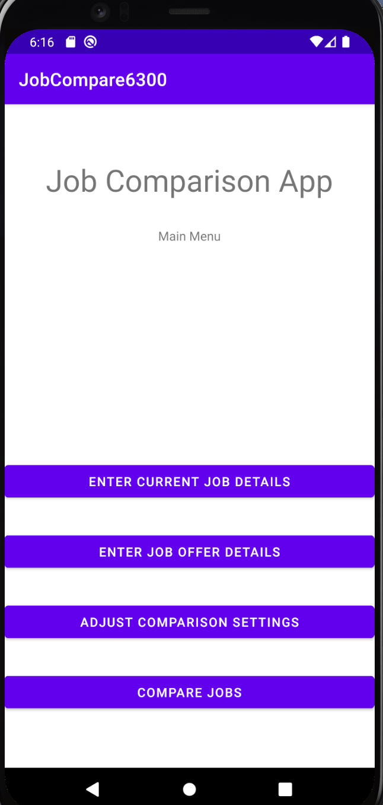
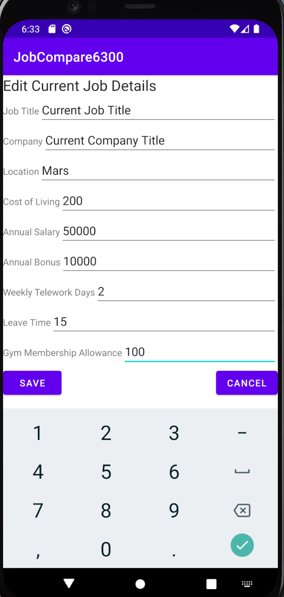
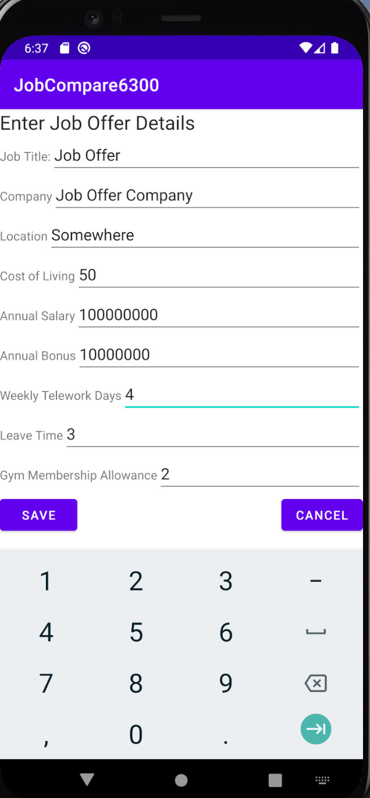
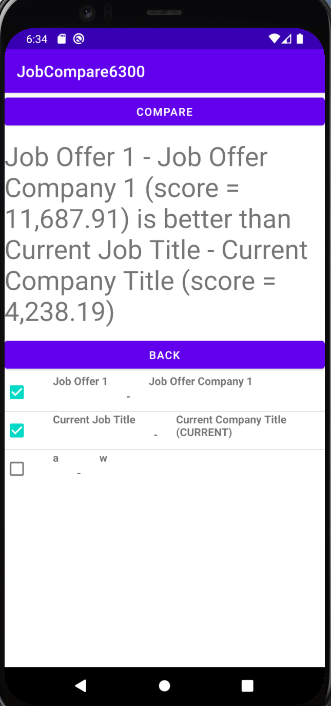

# User Manual

**Author** : Team 020

Welcome to JobCompare6300.

## Index:  
  
* 1.Introduction
* 2.Start to use the App
* 3.Input current job
* 4.Input job offers
* 5.Setup comparison settings  
* 6.Compare job offers
* 7.Ranking job offers
* 8.Exit and go back to main menu
* 9.Contact us

### 1. Introduction

Hello! Welcome to our JobCompare6300 App! Of course we will go over the basics here before we begin. This project is for an app to enter or edit the details of a user's current job and enter the details of any job offers. The user can also edit the comparison settings and compare the current job to any job offer, or comare any two job offers to each other.

### 2. Start to use the App

#### 2.1 Downloading the App

Where can you find this app? The application can be found in the app store. The App can be found in "Google Play Store." Once you have found this you can simply download and install it on user's device. 

#### 2.2 Open the App

click the App icon to enter the App. And you will see the main menu which provides four main functions including :"enter current job details", "enter job offer details", "adjust comparison settings", and "compare jobs".

### 3. Input/edit current job

The user can enter his current job information from the main page of the application by click the "enter current job details" button. Then he is able to put in their data as specified in the form. The user is able to save their job information into the app by click the "save" button. While if they decide to not save the information, in which the information they inputted will not be saved by just click "cancel" or "exit to main menu" buttons.

### 4. Input/edit job offers

The user will be entering various job offer information after enter the interface of "enter job offer details" page by click the "enter job offer details" button on the main menu. The user is able to input job offer details as expected. The user is able to save the data they inputted. by click the "save" button. While if they decide to not save the information, in which the information they inputted will not be saved by just click "cancel" or "exit to main menu" buttons.

### 5. Setup comparison settings  

After click the "adjust comparison settings", you can enter the page of "Adjust Comparison Weights".  There are five parameters that allow users to adjust. They are "Annual Salary Weight", "Annual Bonus Weight", "Telework Weight", "Leave Time Weight", "Gym Allowance Weight". The initial values are 1. The user is able to adjust these weights to any integer appropriate. The user will not make any changes if the default input weights look appropriate to them.  User is able to save the weights they inputted. The user is able to adjust the user weights, and is able to save them by click the "save" button, otherwise, the default specified will be used. 

### 7. Compare job offers

On the main menu, the user is able to click "Compare jobs" button, and then select two jobs that they want to compare. The job offers stored in the database are listed in the interface. User can specify the jobs that they want to create a comparison for. After click "COMPARE" button, user will gose to "compare_jobs_row" page and see the comparison detail. This will then create a table of the job list for for the comparison.

### 8. Ranking job offers

On the Compare jobs screen, the jobs are automatically ranked by the job score as computed by their weighted values.

### 9. Exit and go back to main menu

User is able to return to the main menu after taking any of the four options from the main menu. The user has chosen one of the four options: edit/enter current job info, enter job offer info, adjust comparison weights, compare jobs, and is on one of their respective interfaces, and wants to return to the main menu.

### 10. Contact us

Please feel free to contact us to ensure that your experience is good. You can reach us at dstrube3@gatech.edu. 

Thanks for downloading!
